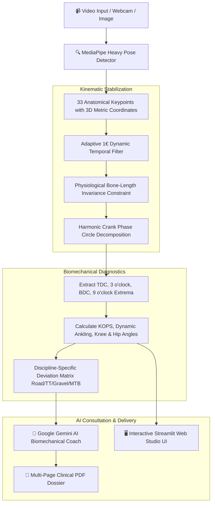

# 🚴 NintAi: The AI-Powered Bike Fit Studio

<p align="center">
  
  
  
  
  
  <a href="https://colab.research.google.com/github/pgeedh/NintAi-The-AI-Powered-Bike-Fit-Studio/blob/main/notebooks/NintAi_Google_Colab_Demo.ipynb">
    
  </a>
</p>

<h3 align="center">
  Transform your laptop into an elite, clinical-grade 3D biomechanical bike fitting laboratory.
</h3>

<p align="center">
  <i>Dynamic Motion Capture • 33 Anatomical Keypoints • 4-Phase Stroke Decomposition • Google Gemini Biomechanical Coaching • Automated PDF Clinical Reports</i>
</p>

---

## 🎬 Live Tracking & Studio Demo

<p align="center">
  <!-- Place your demo GIF in assets/examples/images/demo_tracking.gif -->
  
</p>

<p align="center">
  <sub>Real-time BlazePose Heavy skeletal tracking • Jitter-free 1€ dynamic filtering • True heel/toe ankling geometry</sub>
</p>

---

## 💡 Why NintAi? (Comparison with Commercial Fit Systems)

| Capability | 🏢 **Retül 3D Fit** | 📱 **MyVeloFit** | 🚴 **NintAi (Open Source)** |
| :--- | :---: | :---: | :---: |
| **Cost** | **$350 – $500** / session | **$75 – $150** / year | **100% Free & Open Source** |
| **Hardware Required** | $15,000 Vantage 3D rig | Smartphone / Web | **Any Webcam or Phone Video** |
| **Keypoint Density** | 8 active LED markers | 17 standard 2D points | **33 High-Fidelity 3D Landmarks** |
| **Foot / Ankling Kinematics** | ✅ Yes | ❌ Virtual Estimate | **✅ True Heel & Toe Tracking** |
| **Kinematic Filtering** | Proprietary Hardware | Basic smoothing | **Adaptive 1€ Filter + Bone Invariance** |
| **AI Biomechanical Insights** | Human Fitter only | Template text | **🧠 Google Gemini 2.0 / 3 AI Coach** |
| **Privacy & Local Execution** | In-studio only | Cloud server upload | **🔒 100% Offline / Local Execution** |

---

## 🌟 Core Features

- **⚡ 33-Keypoint BlazePose Heavy Engine:** Tracks full body kinematics at 30+ FPS, including full heel and toe geometry for accurate pedal spindle tracking.
- **🔄 Harmonic 4-Phase Pedal Breakdown:** Automatically decomposes dynamic pedaling cycles into:
  1. **Top Dead Center (TDC / 12 o'clock):** Minimum knee flexion & closed hip compression.
  2. **Power Phase (3 o'clock):** Peak torque delivery & KOPS (Knee Over Pedal Spindle) alignment.
  3. **Bottom Dead Center (BDC / 6 o'clock):** Holmes method knee extension extrema ($140^\circ - 150^\circ$).
  4. **Recovery Phase (9 o'clock):** Upstroke ankle lift and pelvic stability.
- **🤖 Gemini AI Biomechanical Coach:** Translates joint angle deviations into millimeter saddle height, fore-aft, and handlebar stack/reach adjustments.
- **📄 Quad-View Clinical PDF Generator:** Exports publication-quality fitting dossiers with annotated stills, radar charts, and diagnostic scorecards.
- **🖥️ Interactive Web Studio (`app.py`):** Zero-terminal Streamlit web application with real-time angle gauges, video scrubber, and live report generation.
- **📐 Interactive Bike Geometry Calibration:** Measure frame Stack, Reach, and Saddle Height directly from photos with 1-click scale calibration.

---

## 📊 Biomechanical Reference Ranges

NintAi supports custom angle target profiles across all cycling disciplines:

```
                  CYCLING BIOMECHANICAL ANGLE TARGETS
 ┌───────────────────────────┬──────────────┬──────────────┬──────────────┐
 │ Joint / Phase             │ Road Racing  │ TT / Tri     │ Gravel/Endur │
 ├───────────────────────────┼──────────────┼──────────────┼──────────────┤
 │ Knee Extension (BDC 6h)   │ 140° - 150°  │ 145° - 153°  │ 138° - 148°  │
 │ Knee Flexion (TDC 12h)    │ 68° - 75°    │ 65° - 72°    │ 70° - 78°    │
 │ Hip Closed Angle (TDC)    │ 45° - 55°    │ 40° - 48°    │ 50° - 60°    │
 │ Torso Incline to Horiz.   │ 40° - 50°    │ 15° - 25°    │ 45° - 55°    │
 │ Shoulder / Upper Arm      │ 85° - 95°    │ 80° - 90°    │ 85° - 95°    │
 │ Ankle Angle at BDC        │ 90° - 105°   │ 95° - 110°   │ 90° - 100°   │
 └───────────────────────────┴──────────────┴──────────────┴──────────────┘
```

---

## 🏗️ Architecture & Kinematic Pipeline



---

## 🚀 Quickstart & Installation

### Option 1: One-Click Interactive Web Studio (Recommended)

```bash
# 1. Clone the repository
git clone https://github.com/pgeedh/NintAi-The-AI-Powered-Bike-Fit-Studio.git
cd NintAi-The-AI-Powered-Bike-Fit-Studio

# 2. Install dependencies & auto-download models
pip install -r requirements.txt
python scripts/download_models.py

# 3. Launch the Studio Web UI!
streamlit run app.py
```
> Open your browser at `http://localhost:8501` to drag and drop videos and view real-time angle gauges.

---

### Option 2: Command Line CLI

**Dynamic Video Fitting:**
```bash
python src/analyze_video.py \
  --input assets/examples/videos/testvideo2.mp4 \
  --output output/annotated_fit.mp4 \
  --api_key "YOUR_GEMINI_API_KEY"
```

**Static Image Geometry Measurement:**
```bash
python src/analyze_image.py \
  --input assets/examples/images/3.webp \
  --calibrate \
  --measure_bike
```

---

### Option 3: Docker 1-Command Run

```bash
docker-compose up --build
```
> Access the studio instantly at `http://localhost:8501`.

---

## 📑 Clinical Report Sample

<p align="center">
  
</p>

Every session generates `output/final_nintai_report.pdf` containing:
- **Quad-Phase High-Res Stills** (TDC, Max Torque, BDC, Upstroke).
- **Millimeter Adjustment Prescriptions** (Saddle height $\pm\text{mm}$, Saddle fore-aft, Stem reach).
- **AI Coach Verdict** detailing aerodynamic drag vs power output tradeoffs.

---

## 📁 Repository Structure

```
NintAi/
├── app.py                   # Interactive Streamlit Web Studio UI
├── notebooks/
│   └── NintAi_Google_Colab_Demo.ipynb # Free 1-Click Cloud GPU Demo
├── scripts/
│   └── download_models.py   # Automated weights downloader
├── src/
│   ├── analyze_video.py     # Main dynamic video fitting pipeline
│   ├── analyze_image.py     # Static image & bike geometry analysis
│   ├── tracking_mp.py       # MediaPipe BlazePose Heavy 3D wrapper
│   ├── core.py              # Biomechanical kinematics & 1€ filter
│   ├── ai_report.py         # Google Gemini AI consultation engine
│   ├── report.py            # Clinical PDF report generator (FPDF)
│   └── models/              # Neural weights & task bundles
├── docs/
│   └── LAUNCH_KIT.md        # Viral social media launch playbook
├── Dockerfile               # Production container image
├── docker-compose.yml       # Local multi-service config
├── pyproject.toml           # Modern Python packaging
└── requirements.txt         # Project dependencies
```

---

## 🤝 Contributing

We welcome contributions from cyclists, biomechanists, and computer vision engineers!
1. Fork the Project
2. Create your Feature Branch (`git checkout -b feature/NewKinematicMetric`)
3. Commit your Changes (`git commit -m 'Add Knee Lateral Wobble Metric'`)
4. Push to the Branch (`git push origin feature/NewKinematicMetric`)
5. Open a Pull Request

---

## 📜 License & Citation

Distributed under the **MIT License**.

```bibtex
@software{geedh2024nintai,
  author = {Pruthvi Omkar Geedh},
  title = {NintAi: AI-Powered Biomechanical Bike Fitting Studio},
  year = {2024},
  url = {https://github.com/pgeedh/NintAi-The-AI-Powered-Bike-Fit-Studio}
}
```

<p align="center">
  <sub>Crafted with ❤️ for the passion of cycling and triathlon by <a href="https://github.com/pgeedh">Pruthvi</a>.</sub>
</p>
