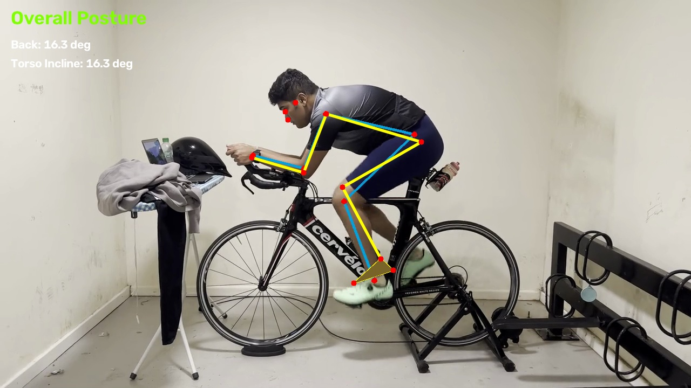
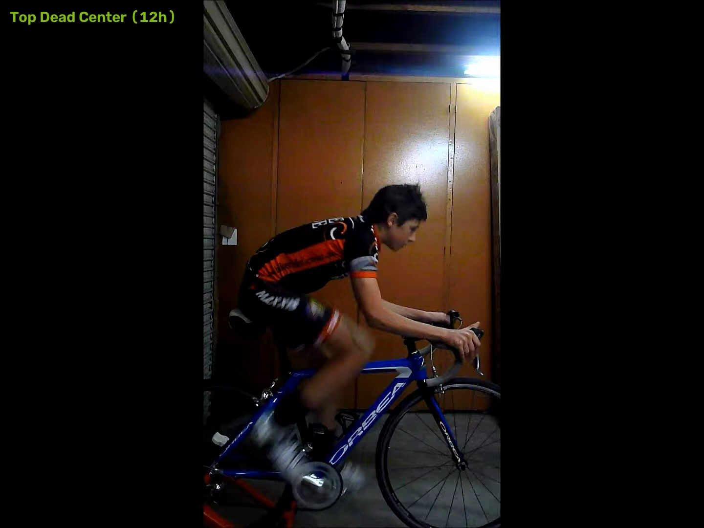
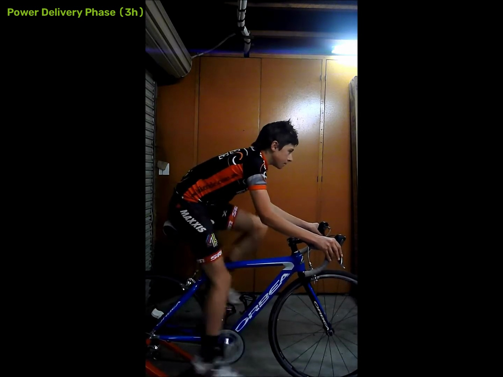
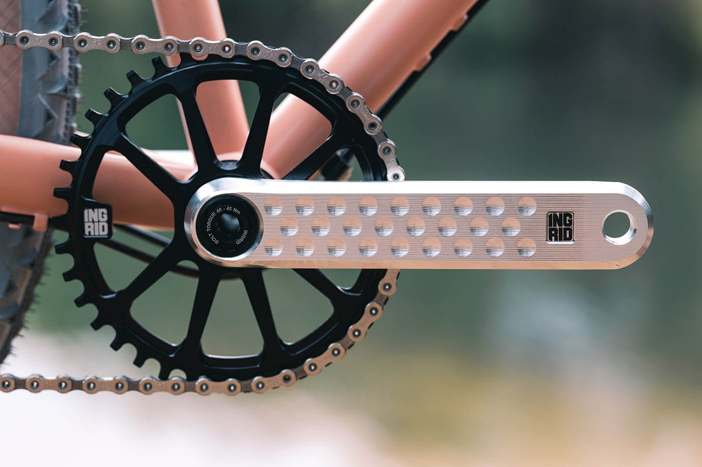

# Open-BikeFit
### The Open-Source Biomechanical Bike Fit Studio

[](https://opensource.org/licenses/MIT)
[](https://www.python.org/downloads/)
[](https://developers.google.com/mediapipe)
[](http://localhost:8080)

Open-BikeFit is an open-source dynamic bike fitting studio. It transforms standard 30/60 FPS trainer video into multi-revolution biomechanical joint angle telemetry, 4-phase pedal stroke breakdowns, and millimeter hardware adjustment reports.



---

## The Motivation: Why Open-BikeFit Exists

### The $500 Barrier in Cycling
A professional 3D bike fitting session at a specialized studio typically costs between $350 and $500. For many cyclists, triathletes, and beginners, this high financial barrier prevents them from dialling in a comfortable, injury-free position.

Furthermore, dynamic bike fitting is not a one-time static event. It is an iterative process. Whenever a rider:
- Swaps saddles or adjusts saddle height,
- Installs new cycling shoes, insoles, or cleat positions,
- Upgrades handlebars, stems, or crank arm lengths,
- Experiences changes in flexibility, fitness, or riding posture over a season,

they need to re-verify their joint angles. Waiting weeks and paying hundreds of dollars for every minor adjustment slows down iteration and progression.

### The Mechanic and Car Analogy
> Taking your car to a certified master mechanic provides reassurance and expertise for complex overhauls. However, understanding how your vehicle functions and having access to diagnostic tools allows you to maintain, tune, and iterate on your machine at home with precision.

Getting an in-person professional fit from an experienced fitter is valuable, particularly when managing physical asymmetries or rehabilitation. Open-BikeFit serves as an open-source, high-precision computer vision baseline tool that empowers every cyclist to calculate their kinematic angles and test physical millimeter wrench adjustments rapidly at home.

> [!NOTE]
> **Kinematic Baseline Notice:** Open-BikeFit is a geometric kinematic posture estimation tool designed to assist riders and bike fitters. It is not a medical device or physical therapy diagnostic service.

---

## 4-Phase Dynamic Pedal Stroke Decomposition

Open-BikeFit automatically identifies and extracts the four key phases of the dynamic cycling pedal stroke:

| Phase 1: Top Dead Center (12h Flexion) | Phase 2: Power Phase (3h Drive) |
| :---: | :---: |
|  |  |
| **Minimum knee angle & closed hip clearance** | **Peak torque generation & KOPS alignment** |

| Phase 3: Bottom Dead Center (6h Extension) | Phase 4: Full Kinetic Chain Profile |
| :---: | :---: |
|  |  |
| **Maximum leg extension (Holmes method)** | **Torso incline, shoulder reach & pelvic stability** |

---

## Key Features and Architecture

```
                                  OPEN-BIKEFIT STUDIO PIPELINE
  +------------------+     +---------------------+     +------------------------+
  |  Rider Intake &  | --> |  Studio Setup &     | --> |  BlazePose 33-Landmark |
  |  Profile Goal    |     |  Calibration Check  |     |  Sub-Pixel CV Engine   |
  +------------------+     +---------------------+     +------------------------+
                                                                   |
                                                                   v
  +------------------+     +---------------------+     +------------------------+
  | Professional Fit | <-- |  Apple HIG Studio   | <-- |  1€ Adaptive Filter &  |
  | Report & Wrench  |     |  Telemetry Gauges   |     |  Kinematic Math Solver |
  +------------------+     +---------------------+     +------------------------+
```

### 1. Apple Human Interface Guidelines (HIG) UI
- Monochromatic Space Graphite theme (`#000000`, `#1C1C1E`, `#2C2C2E`) with subtle hairline borders (`rgba(255, 255, 255, 0.08)`).
- Cupertino system accent color palette (`#0A84FF` Blue, `#30D158` Green, `#FF9F0A` Amber, `#FF453A` Red).
- High-contrast telemetry cards with live target gauges and status indicators.

### 2. Multi-Step Onboarding Workflow (MyVeloFit Model)
- **Step 1: Rider Intake & Account Profile:** Captures Name, Email, Height (cm), Inseam (cm), Bike Model, Discipline (Road, Gravel, TT/Triathlon, MTB), Flexibility level, and Specific Symptom/Pain Point Checklist.
- **Step 2: Studio Setup & Calibration Guide:** 5-point checklist covering camera height (~70cm at crank axle level), distance (2.5 to 3.5m at 90 degrees), drive-side orientation, contrast attire, and trainer warm-up.
- **Step 3: Video Input & Pre-Flight:** Drag-and-drop video upload or 1-click loading of curated test datasets with pre-flight FPS and resolution inspection.
- **Step 4: Kinematic Motion Capture:** MediaPipe BlazePose Heavy 33-landmark tracking with 1€ adaptive filtering and bone length constraint enforcement.
- **Step 5: Biomechanical Telemetry Studio:** 6 metric cards with target range meters and status badges, side-by-side synchronized video playback, and 4-phase freeze-frame stills.
- **Step 6: Studio Fit Report & Wrench Guide:** Multi-provider report generation engine (Claude 3.7 / 3.5, Gemini 2.0 Flash, or 100% Offline Rule Engine) + high-resolution PDF export + JSON fit profile.

### 3. Deterministic Kinematic Math and Guardrails
- All joint angle mathematics and spatial tracking are computed locally via deterministic trigonometry.
- External LLM API keys are used strictly for formatting and writing the narrative report and wrench instructions.

---

## Biomechanical Mathematical Formulations



### 1. Knee Extension at BDC (6 o'clock)
Measured at maximum pedal extension (Bottom Dead Center) using the **Holmes et al. protocol**:
$$\theta_{\text{knee}} = \arccos\left(\frac{\mathbf{v}_{\text{femur}} \cdot \mathbf{v}_{\text{tibia}}}{\|\mathbf{v}_{\text{femur}}\| \|\mathbf{v}_{\text{tibia}}\|}\right)$$
- **Road Target:** $140^\circ - 150^\circ$ (Prevents patellar compression while avoiding hamstring strain).

### 2. Knee Flexion at TDC (12 o'clock)
Measured at minimum leg extension (Top Dead Center) using the **Pruitt formulation**:
- **Road Target:** $68^\circ - 75^\circ$ (Protects the anterior knee and ensures hip clearance).

### 3. Closed Hip Angle (12 o'clock)
Interior angle formed by the torso vector and femur vector at top of pedal stroke:
$$\theta_{\text{hip}} = \arccos\left(\frac{(\mathbf{p}_{\text{shoulder}} - \mathbf{p}_{\text{hip}}) \cdot (\mathbf{p}_{\text{knee}} - \mathbf{p}_{\text{hip}})}{\|\mathbf{p}_{\text{shoulder}} - \mathbf{p}_{\text{hip}}\| \|\mathbf{p}_{\text{knee}} - \mathbf{p}_{\text{hip}}\|}\right)$$
- **Road Target:** $45^\circ - 55^\circ$ (Maintains an open diaphragm and smooth breathing).

### 4. Reference Range Comparison by Discipline

| Kinematic Metric | Road Endurance | Road Race / Aero | Gravel & All-Road | Triathlon & TT | MTB (XC) |
| :--- | :---: | :---: | :---: | :---: | :---: |
| **Knee Extension (BDC 6h)** | $140^\circ - 148^\circ$ | $142^\circ - 150^\circ$ | $138^\circ - 148^\circ$ | $145^\circ - 153^\circ$ | $135^\circ - 145^\circ$ |
| **Knee Flexion (TDC 12h)** | $70^\circ - 76^\circ$ | $68^\circ - 74^\circ$ | $70^\circ - 78^\circ$ | $65^\circ - 72^\circ$ | $72^\circ - 80^\circ$ |
| **Closed Hip Angle (TDC)** | $48^\circ - 56^\circ$ | $44^\circ - 52^\circ$ | $50^\circ - 60^\circ$ | $40^\circ - 48^\circ$ | $55^\circ - 65^\circ$ |
| **Torso Incline (to horiz.)**| $42^\circ - 50^\circ$ | $36^\circ - 44^\circ$ | $45^\circ - 55^\circ$ | $15^\circ - 25^\circ$ | $50^\circ - 60^\circ$ |
| **Shoulder / Reach Angle** | $85^\circ - 92^\circ$ | $88^\circ - 95^\circ$ | $85^\circ - 95^\circ$ | $80^\circ - 90^\circ$ | $90^\circ - 100^\circ$ |
| **Ankling at BDC** | $90^\circ - 102^\circ$ | $92^\circ - 105^\circ$ | $90^\circ - 100^\circ$ | $95^\circ - 110^\circ$ | $85^\circ - 95^\circ$ |

---

## Comparison with Commercial Systems

| Feature | Retül 3D Studio | MyVeloFit | BikeFastFit | Open-BikeFit |
| :--- | :---: | :---: | :---: | :---: |
| **Cost** | $350 - $500 | $35 - $75/yr | $15 App | **100% Free & Open Source** |
| **Hardware Required** | Optical LED Harness | Web Browser / Cam | iOS Device | **Any Computer (Linux/Mac/Win)** |
| **Keypoint Density** | 8 LED Markers | 17 Keypoints | Manual Taps | **33 Heavy Landmarks (BlazePose)** |
| **Foot Kinematics** | Heel Only | Basic Ankle | None | **Ankle, Heel & Toe (3D Vector)** |
| **Studio Report Engine** | Proprietary PDF | Cloud Automated | Basic Overlay | **Claude 3.7 / Gemini / 100% Offline** |
| **Privacy / Local Run** | Studio Only | Cloud Upload | Local Device | **100% Local Processing** |

---

## Quick Start Guide

### 1. Clone and Setup Environment
```bash
git clone https://github.com/pgeedh/Open-BikeFit-The-AI-Powered-Bike-Fit-Studio.git
cd Open-BikeFit-The-AI-Powered-Bike-Fit-Studio

python3 -m venv .venv
source .venv/bin/activate
pip install -r requirements.txt
```

### 2. Download Model Checkpoint
```bash
python scripts/download_models.py
```

### 3. Launch the Studio Web App
```bash
streamlit run app.py --server.port=8080
```
Open `http://localhost:8080` in your web browser.

---

## Repository Directory Structure

```
Open-BikeFit/
├── app.py                     # Apple HIG Multi-Step Studio Web App
├── src/
│   ├── tracker.py             # MediaPipe BlazePose Heavy 33-Landmark Tracker
│   ├── kinematics.py          # Biomechanical Angle Formulations & 1€ Filter
│   ├── ai_fitter.py           # Studio Report Engine (Claude / Gemini / Offline)
│   ├── pdf_generator.py       # High-Resolution PDF Studio Report Builder
│   └── analyzer.py            # Video Motion Capture Pipeline CLI
├── inputs/
│   ├── videos/                # Sample and uploaded trainer rides
│   └── images/                # Reference test frames & geometry
├── outputs/
│   ├── videos/                # Annotated motion capture MP4s
│   ├── snapshots/             # 4-Phase cycle stills (TDC, Power, BDC, Overall)
│   └── reports/               # Compiled PDF fit reports
├── docs/
│   └── images/                # Permanent documentation image assets
├── models/                    # Model tasks and checkpoints
└── scripts/
    └── download_models.py     # Automated neural asset downloader
```

---

## License
This project is licensed under the **MIT License**.
